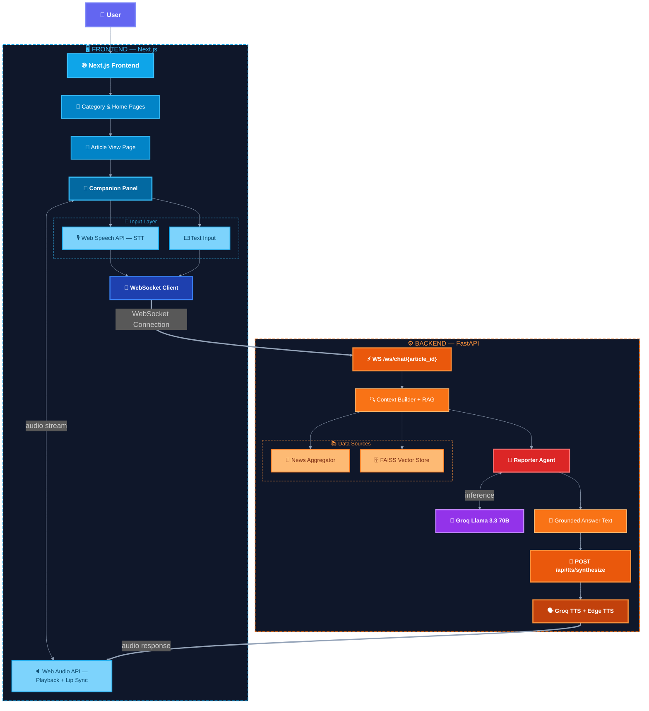
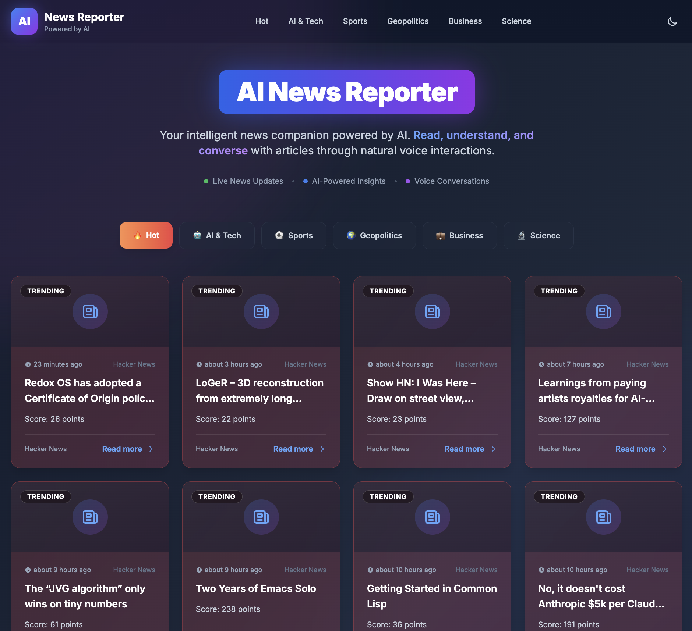
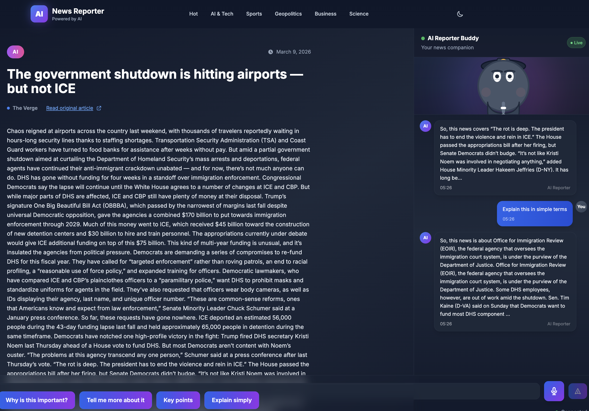

# AI News Reporter

An intelligent news platform that aggregates real-time news and enables users to have interactive voice conversations with an AI-powered news companion. The system combines multi-source news aggregation, a multi-agent RAG backend, and a futuristic animated AI reporter that talks users through each article.

## Features

- 📰 **Multi-Source News Aggregation**: Fetches news from Google News RSS, Hacker News, and GNews API, with graceful fallbacks and caching.
- 🤖 **AI-Powered Companion**: Animated reporter avatar that summarizes articles, adds context, and answers follow-up questions conversationally.
- 🎤 **Voice Interaction**: Browser-native speech recognition plus neural text-to-speech for hands-free news consumption.
- 💬 **Real-Time Chat**: WebSocket-based, article-grounded conversation powered by a multi-agent RAG pipeline.
- 🎨 **Futuristic UI**: Glassmorphism, gradients, smooth transitions, and an immersive two-panel layout (article on the left, AI reporter on the right).
- ⚡ **Low Latency**: End-to-end voice-to-voice target under 3 seconds, with an explicit latency budget across each component.

## System Architecture

High-level architecture of the platform:




## UI Preview

These screenshots show the two primary user-facing interfaces of the system.

### Landing / First Interface



### Article + AI Agent Interface



## Tech Stack

### Backend
- **FastAPI**: Async web framework
- **LangChain + LangGraph**: Multi-agent orchestration
- **Groq API**: Ultra-fast LLM inference (~200–500 ms typical)
- **FAISS**: Vector similarity search
- **sentence-transformers**: Local embeddings
- **Groq TTS + Edge TTS**: Neural text-to-speech with automatic fallback
- **newspaper3k**: Article content extraction

### Frontend
- **Next.js 14**: React framework with App Router
- **TypeScript**: Type safety
- **TailwindCSS**: Styling
- **Framer Motion**: Animations
- **Web Speech API**: Browser-native STT
- **Web Audio API**: Audio playback and lip sync

## Setup Instructions

### Prerequisites

- Python 3.9+
- Node.js 18+
- Groq API key ([Get one here](https://console.groq.com))
- GNews API key (optional, [Get one here](https://gnews.io))

### Backend Setup

1. Navigate to the backend directory:
```bash
cd backend
```

2. Create a virtual environment:
```bash
python -m venv venv
source venv/bin/activate  # On Windows: venv\Scripts\activate
```

3. Install dependencies:
```bash
pip install -r requirements.txt
```

4. Create a `.env` file from `.env.example`:
```bash
cp .env.example .env
```

5. Edit `.env` and add your API keys:
```env
GROQ_API_KEY=your_groq_api_key_here
GNEWS_API_KEY=your_gnews_api_key_here  # Optional
BACKEND_URL=http://localhost:8000
FRONTEND_URL=http://localhost:3000
```

6. Run the backend server:
```bash
uvicorn app.main:app --reload --host 0.0.0.0 --port 8000
```

The API will be available at `http://localhost:8000`

### Frontend Setup

1. Navigate to the frontend directory:
```bash
cd frontend
```

2. Install dependencies:
```bash
npm install
```

3. Create a `.env.local` file:
```bash
cp .env.example .env.local
```

4. Edit `.env.local`:
```env
NEXT_PUBLIC_API_URL=http://localhost:8000
NEXT_PUBLIC_WS_URL=ws://localhost:8000
```

5. Run the development server:
```bash
npm run dev
```

The frontend will be available at `http://localhost:3000`

## Usage

1. **Browse News**: Navigate through different categories (Hot, AI & Tech, Sports, Geopolitics, Business, Science)
2. **Read Articles**: Click on any news card to view the full article
3. **Interact with AI Companion**: 
   - The AI companion automatically greets you with an article summary
   - Ask questions via voice (click the microphone button) or text input
   - The avatar animates and speaks responses
   - Use the mute button to silence audio while reading

## Project Structure

```
Project ANC/
├── backend/
│   ├── app/
│   │   ├── main.py              # FastAPI entry point
│   │   ├── config.py            # Configuration
│   │   ├── routers/             # API routes
│   │   ├── agents/              # Multi-agent system
│   │   ├── services/            # Business logic
│   │   └── models/              # Data models
│   └── requirements.txt
├── frontend/
│   ├── src/
│   │   ├── app/                 # Next.js pages
│   │   ├── components/          # React components
│   │   ├── hooks/               # Custom hooks
│   │   └── lib/                 # Utilities
│   └── package.json
└── README.md
```

## API Endpoints

### News API
- `GET /api/news?category={category}&page={page}&page_size={size}` - Get news articles
- `GET /api/news/trending` - Get trending news
- `GET /api/news/article/{article_id}` - Get full article content

### Chat API
- `WS /ws/chat/{article_id}` - WebSocket connection for chat

### TTS API
- `POST /api/tts/synthesize` - Synthesize speech from text
 
## Latency Budget & Performance Targets

The system was designed with an explicit latency budget to keep the end-to-end voice conversation experience smooth and responsive.

### Latency Budget (Planning Targets)

| Stage                                      | Target Latency        | Notes |
|-------------------------------------------|-----------------------|-------|
| Microphone capture + browser STT (Web Speech API) | **300–700 ms**        | Depends on utterance length and browser; runs fully on the client. |
| WebSocket transport (client → backend)    | **\<100 ms**          | Local development and typical broadband conditions. |
| Retrieval + RAG context building          | **200–500 ms**        | FAISS similarity search + chunk selection and formatting. |
| Groq LLM generation (Llama 3.3 70B)       | **200–500 ms**        | Using Groq’s low-latency inference. |
| TTS synthesis (Groq TTS / Edge TTS)       | **400–800 ms**        | Includes text cleaning, API call, and audio bytes transfer. |
| Audio decoding + playback start           | **\<200 ms**          | Web Audio API setup and buffer scheduling. |
| **End-to-end voice → voice**              | **\<3 seconds total** | Sum of the above under normal conditions. |

### Runtime Performance Targets

- **End-to-end latency** (voice input → voice output): **\< 3 seconds**
- **News cache TTL**: **15 minutes** (to stay fresh without over-hitting free APIs)
- **FAISS index cache**: **LRU cache, max 100 articles** (recently viewed articles kept hot in memory)

## Limitations & Future Improvements

- **Current Limitations**:
  - GNews API has 100 requests/day limit (caching mitigates this)
  - Web Speech API accuracy varies by browser
  - Article scraping may fail for some sites

- **Future Enhancements**:
  - Multi-article conversation support
  - Multilingual support
  - Custom avatar customization
  - Mobile app version
  - User accounts and saved articles

## License

This project is proprietary and is offered under the **MIT License**.  
Copyright (c) 2025 **Mohan Bhosale**. All rights reserved.

See [LICENSE](LICENSE) for the full license text.

## Authors

- Mohan Bhosale
- Karthikeyan Sugavanan
