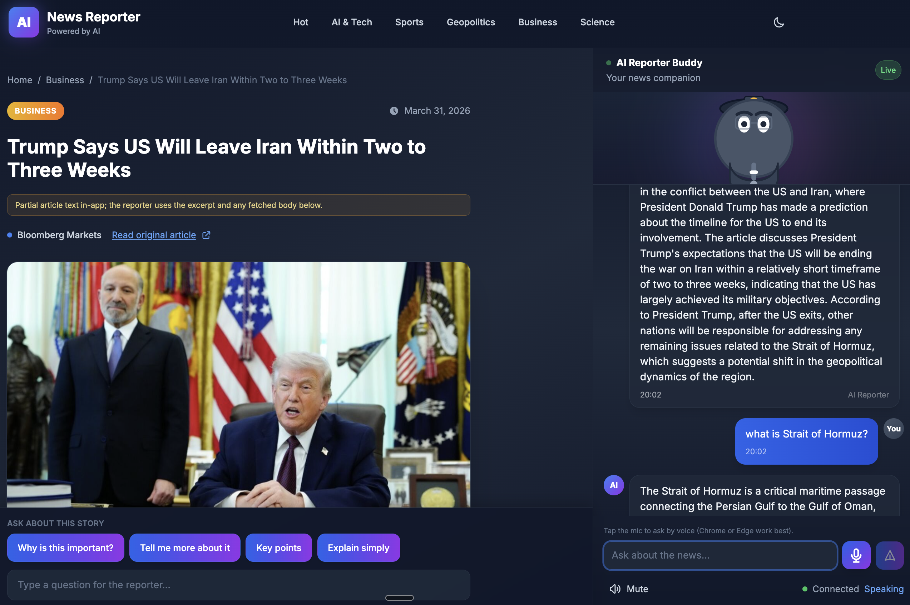
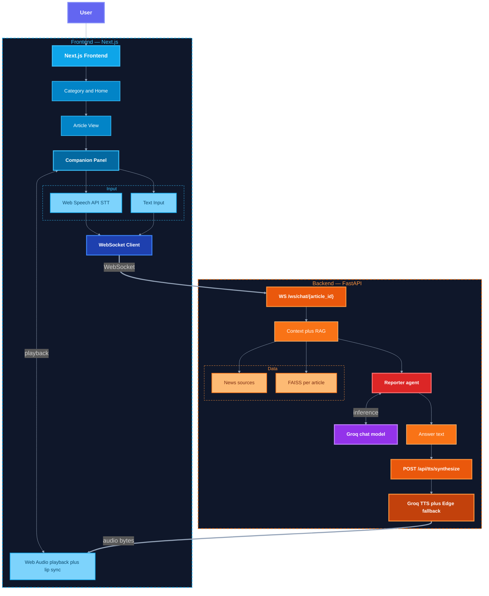

# NewsBuddy AI

### Problem

News is scattered across sites and formats. Long articles are slow to parse, and **generic assistants** are a poor fit: they are not tied to the page you are reading, and they may **hallucinate** or drift off-topic. Readers need a fast way to **orient** on a story and ask **follow-ups that stay grounded in that article** (and optionally in a thin layer of live web context when enabled), without leaving the reading flow.

### Solution

We built a **single-session companion per article**: when you open a story, the system ingests available article text, indexes it for **retrieval-augmented generation (RAG)**, and opens a **WebSocket** chat that streams an opening summary and then answers your questions using retrieved chunks as context. You can type or use **browser speech-to-text**; replies can be **read aloud** via TTS. That keeps the model **anchored to the source** you chose, not to the open web by default.

### What is NewsBuddy AI?

**NewsBuddy AI** is that product: a **full-stack web application** that combines a **Next.js** frontend with a **FastAPI** backend, **FAISS**-backed embeddings over article chunks, **Groq** for the language model, optional **Tavily** for web snippets when the pipeline allows it, and **TTS** (Groq with Edge fallback) so the companion can speak. It is the name we use for the app, the API, and the voice + chat experience described above.

**Maintainers:** Mohan Bhosale, Karthikeyan Sugavanan

---

## Features

1. **News feed** — Categories and trending lists from RSS and optional provider APIs ([backend/README_API_SETUP.md](backend/README_API_SETUP.md)).
2. **Article view** — Full or partial body when scraping succeeds; the UI surfaces when content is truncated.
3. **Companion chat** — Per-article WebSocket session: opening summary, then Q&A via **text** or **browser speech-to-text** (Web Speech API).
4. **Spoken replies** — Assistant text is synthesized through `POST /api/tts/synthesize` (Groq primary, Edge TTS fallback) with playback and lip-sync in the companion panel.

Performance focus: minimize time from user send to first assistant text on screen. Client-side timing hooks are documented in [docs/latency.md](docs/latency.md).

---

## Screenshots

Browse categories and trending stories, then open an article. The companion sits beside the reader with voice and text input, suggested prompts, and spoken replies.

### Home & category browsing


### Article view with companion



---

## Quick start

1. Configure **Setup** below. You need at least a **Groq** API key for chat; speech input is most reliable in **Chrome** or **Edge**.
2. Run the backend, then the frontend. Open `http://localhost:3000`.
3. Open an article, wait for the opening message, then send a follow-up (typing works if the microphone is unavailable).
4. Optional: in DevTools → Console, watch `[latency] first_assistant_text_ms` after a send ([docs/latency.md](docs/latency.md)).

Additional provider keys and TTS setup: [backend/README_API_SETUP.md](backend/README_API_SETUP.md), [backend/GROQ_TTS_SETUP.md](backend/GROQ_TTS_SETUP.md).

---

## Architecture (high level)


```mermaid
%%{init: {'theme': 'dark', 'themeVariables': {'fontSize': '20px', 'fontFamily': 'arial', 'lineColor': '#94a3b8', 'primaryColor': '#1e293b', 'primaryTextColor': '#f8fafc', 'primaryBorderColor': '#475569', 'secondaryColor': '#0f172a', 'tertiaryColor': '#1e293b', 'nodeTextSize': '18px'}, 'flowchart': {'curve': 'basis', 'padding': 20, 'nodeSpacing': 30, 'rankSpacing': 50, 'htmlLabels': true, 'wrappingWidth': 200}}}%%

flowchart TB
    U["User"]:::userStyle --> FE["Next.js Frontend"]:::feStyle

    subgraph Frontend["Frontend — Next.js"]
        direction TB
        FE --> CAT["Category and Home"]:::feNode
        CAT --> ART["Article View"]:::feNode
        ART --> COMP["Companion Panel"]:::compStyle

        subgraph InputLayer["Input"]
            direction LR
            STT["Web Speech API STT"]:::inputNode
            TXT["Text Input"]:::inputNode
        end

        COMP --> STT
        COMP --> TXT

        STT --> WS_CLIENT["WebSocket Client"]:::wsStyle
        TXT --> WS_CLIENT

        COMP <-->|"playback"| AUDIO["Web Audio playback plus lip sync"]:::audioNode
    end

    WS_CLIENT ==>|"WebSocket"| WS_API

    subgraph Backend["Backend — FastAPI"]
        direction TB
        WS_API["WS /ws/chat/{article_id}"]:::apiStyle --> CTX["Context plus RAG"]:::beNode

        subgraph DataSources["Data"]
            direction LR
            NEWS["News sources"]:::dataNode
            VEC["FAISS per article"]:::dataNode
        end

        CTX --> NEWS
        CTX --> VEC
        CTX --> AGENT["Reporter agent"]:::agentStyle

        AGENT <-->|"inference"| LLM["Groq chat model"]:::llmStyle

        AGENT --> RESP["Answer text"]:::beNode
        RESP --> TTS_API["POST /api/tts/synthesize"]:::apiStyle
        TTS_API --> TTS["Groq TTS plus Edge fallback"]:::ttsStyle
    end

    TTS ==>|"audio bytes"| AUDIO

    classDef userStyle fill:#6366f1,stroke:#818cf8,stroke-width:3px,color:#fff,font-size:18px,font-weight:bold
    classDef feStyle fill:#0ea5e9,stroke:#38bdf8,stroke-width:3px,color:#fff,font-size:18px,font-weight:bold
    classDef feNode fill:#0284c7,stroke:#38bdf8,stroke-width:2px,color:#fff,font-size:16px
    classDef compStyle fill:#0369a1,stroke:#38bdf8,stroke-width:3px,color:#fff,font-size:16px,font-weight:bold
    classDef inputNode fill:#7dd3fc,stroke:#0ea5e9,stroke-width:2px,color:#0c4a6e,font-size:16px
    classDef wsStyle fill:#1e40af,stroke:#3b82f6,stroke-width:3px,color:#fff,font-size:16px,font-weight:bold
    classDef audioNode fill:#7dd3fc,stroke:#0ea5e9,stroke-width:2px,color:#0c4a6e,font-size:16px
    classDef apiStyle fill:#ea580c,stroke:#fb923c,stroke-width:3px,color:#fff,font-size:16px,font-weight:bold
    classDef beNode fill:#f97316,stroke:#fdba74,stroke-width:2px,color:#fff,font-size:16px
    classDef dataNode fill:#fdba74,stroke:#f97316,stroke-width:2px,color:#7c2d12,font-size:16px
    classDef agentStyle fill:#dc2626,stroke:#f87171,stroke-width:3px,color:#fff,font-size:16px,font-weight:bold
    classDef llmStyle fill:#9333ea,stroke:#c084fc,stroke-width:3px,color:#fff,font-size:16px,font-weight:bold
    classDef ttsStyle fill:#c2410c,stroke:#fb923c,stroke-width:3px,color:#fff,font-size:16px,font-weight:bold

    style Frontend fill:#0f172a,stroke:#0ea5e9,stroke-width:2px,stroke-dasharray:8 4,color:#38bdf8,font-size:18px
    style Backend fill:#0f172a,stroke:#f97316,stroke-width:2px,stroke-dasharray:8 4,color:#fb923c,font-size:18px
    style InputLayer fill:transparent,stroke:#38bdf8,stroke-width:1px,stroke-dasharray:5 3,color:#38bdf8,font-size:15px
    style DataSources fill:transparent,stroke:#fb923c,stroke-width:1px,stroke-dasharray:5 3,color:#fb923c,font-size:15px
```

---

## Tech stack

| Layer | Pieces |
|--------|--------|
| Backend | FastAPI, LangChain / LangGraph orchestration, FAISS + sentence-transformers for chunk embeddings, Groq for LLM, optional Tavily for web snippets |
| Frontend | Next.js 14 (App Router), TypeScript, Tailwind, Framer Motion |
| Speech | Web Speech API (STT in the browser), separate HTTP TTS (`/api/tts/synthesize`) |

Voices and provider behavior: [backend/TTS_OPTIONS.md](backend/TTS_OPTIONS.md).

---

## Setup

### Prerequisites

- Python 3.9 or newer  
- Node.js 18 or newer  
- A **Groq API key** (required for chat; [Groq Console](https://console.groq.com))  
- Optional: GNews, NewsAPI, Guardian, Tavily (see API setup doc)

### Backend

```bash
cd backend
python -m venv venv
source venv/bin/activate   # Windows: venv\Scripts\activate
pip install -r requirements.txt
```

Create `backend/.env` with at least:

```env
GROQ_API_KEY=your_key_here
BACKEND_URL=http://localhost:8000
FRONTEND_URL=http://localhost:3000
```

If the repo includes `.env.example`, you can copy it. Full key list: [backend/README_API_SETUP.md](backend/README_API_SETUP.md).

```bash
uvicorn app.main:app --reload --host 0.0.0.0 --port 8000
```

API root: `http://localhost:8000` — `GET /health` for a quick check.

### Frontend

```bash
cd frontend
npm install
```

Create `frontend/.env.local`:

```env
NEXT_PUBLIC_API_URL=http://localhost:8000
NEXT_PUBLIC_WS_URL=ws://localhost:8000
```

```bash
npm run dev
```

App URL: `http://localhost:3000`

---

## Usage

1. Open the home or category page and choose an article.  
2. On the article page, read on the left; the companion opens on the right and sends an opening message over the WebSocket.  
3. Ask follow-ups by typing or using the mic (allow microphone when the browser prompts).  
4. Mute is available if you want text without playing audio.

Suggested prompts appear on the article page; they forward into the companion panel.

---

## Repository layout

```
Project ANC/
├── backend/
│   ├── app/
│   │   ├── main.py
│   │   ├── config.py
│   │   ├── routers/      # REST, WebSocket, TTS
│   │   ├── agents/       # Reporter and graph
│   │   ├── services/     # News, RAG, scrape, TTS, etc.
│   │   └── models/
│   ├── requirements.txt
│   └── README_API_SETUP.md
├── frontend/
│   └── src/              # app/, components/, hooks/
├── docs/                 # latency notes, deferred Whisper note
└── README.md
```

---

## API summary

| Method | Path | Purpose |
|--------|------|---------|
| GET | `/api/news` | Articles by category |
| GET | `/api/news/trending` | Trending list |
| GET | `/api/news/article/{article_id}` | Single article (body when available) |
| WebSocket | `/ws/chat/{article_id}` | Chat for that article |
| POST | `/api/tts/synthesize` | MP3 speech from text |

---

## Latency and observability

End-to-end latency is not fixed: it depends on Groq queue time, article size, embedding work, browser STT, and network conditions. See [docs/latency.md](docs/latency.md) for console metrics (`[latency] …`) and how to reason about server-side time.

Server-side ASR (e.g. Whisper) is not part of the default stack; rationale and a possible extension path are in [docs/WHISPER_DEFERRED.md](docs/WHISPER_DEFERRED.md).

---

## Known limitations

- Third-party free tiers (news APIs, Groq) may rate-limit; caching reduces but does not eliminate that risk.  
- Browser STT quality varies by engine and locale; Chromium-based browsers are the most consistent target.  
- Many publishers block scraping or use paywalls; the UI may show only a snippet while the model still answers within available text.  
- Reliability in production depends on API keys, quotas, and network path to upstream providers.

---

## License

Released under the MIT License. See [LICENSE](LICENSE).
